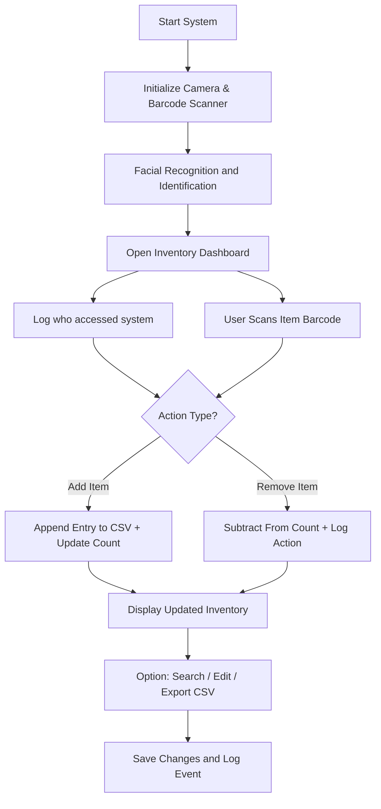

# Medical Inventory System — NASA Hunch 2025-26


A medical inventory system incorporating barcoding for tracking inventory as well as facial recognition for secure access. The project was built as part of the NASA Hunch 2025‑2026 program.  
The app and AI-powered facial recognition software **runs on a Raspberry Pi 4** in order to allow for efficient and low energy running so it can be installed on space stations or long term space missions without major concern for energy pull.

**Note** This project is still under development

## Table of Contents

- [About](#about)
- [Features](#features)
- [Architecture & Components](#architecture--components)
- [System Flowchart](#system-flowchart)
- [Prerequisites](#prerequisites)
- [Installation & Setup](#installation--setup)
   - [Usage](#usage)
   - [Auto-Start Configuration](#auto-start-configuration)
   - [Raspberry Pi 4 Deployment](#raspberry-pi-4-deployment)
- [Facial Recognition Module](#facial-recognition-module)
- [Project Status](#project-status)
- [License](#license)
- [Contact Info](#contact-info)

---

## About
The **Medical Inventory System** is designed to help medical facilities, specifically ones on space stations on aboard space mission, track supplies, manage stock levels, and control access securely using facial recognition.  
Developed for the **NASA Hunch 2025-26** program, the system runs efficiently on a **Raspberry Pi 4** or similar embedded device — suitable for low-power, remote, or space environments. The system can be configured to start automatically on boot, creating a dedicated kiosk-style medical inventory station.


## Features
### Current
- In-app barcode scanning for adding/removing medical items.
- Facial recognition to authenticate users.
- Automatic CSV logging of all inventory actions.
- Real-time display of current inventory in a GUI.
- **Auto-start on boot** — Configure the system to launch automatically, creating a dedicated kiosk system.

### Planned / Future
- Search and filter inventory records.
- Edit and delete individual entries.
- Alerts for low stock or expired items.
- Cloud dashboard for mission monitoring.
- Role-based access control (Admin / User).


## Architecture & Components
| Component | Description |
|---|---|
| `src/medical_inventory.py` | Main GUI and logic for barcode + inventory management. |
| `src/facial_recognition.py` | Handles user authentication via camera and InsightFace. |
| `src/db_manager.py` | Database manager for SQLite inventory and deletion tracking. |
| `inventory.db` | SQLite database storing all inventory transactions. |
| `assets/references/` | Directory containing facial reference images for authorized users. |
| `scripts/install_autostart.sh` | Script to configure the system to start automatically on boot. |
| `scripts/start_medical_inventory.sh` | Startup script that launches the application with proper environment. |
| `docs/` | Comprehensive documentation for setup, deployment, and troubleshooting. |
| `tests/` | Test suite for database, application, and auto-start functionality. |
| Hardware | **Raspberry Pi 4** (2GB+ RAM), USB barcode scanner, and camera module. |


## System Flowchart
Below is a visual overview of how the system operates from authentication to inventory management.



> The flow above represents how user authentication, barcode scanning, and logging interact in the overall system workflow.


## Prerequisites

### Hardware (Raspberry Pi 4)
- **Raspberry Pi 4** (Model B, 2GB RAM minimum, 4GB or 8GB recommended)
- **MicroSD Card** (16GB minimum, 32GB+ recommended, Class 10 or UHS-I)
- **Power Supply** (Official Raspberry Pi 5V 3A USB-C adapter)
- **Camera** (USB Webcam or Raspberry Pi Camera Module v2/v3)
- **Barcode Scanner** (USB, configured as HID keyboard device)
- **Display** (HDMI monitor or touchscreen)
- Optional: Heatsinks or cooling fan for sustained operation

### Software
- **Raspberry Pi OS** (64-bit with Desktop recommended)
- **Python 3.10+** (included with Raspberry Pi OS)
- **Pip package manager**
- **Python packages**: `insightface`, `onnxruntime`, `opencv-python`, `numpy`, `tk`

### Prerequisites for facial recognition authentication
  
- A webcam or camera for facial recognition
- Clear, forward-facing facial images for each authorized user  
- Connect your camera and barcode scanner before running.


## Installation & Setup
1. Clone the repository:
   ```bash
   git clone https://github.com/ltl902/Medical-Inventory-System-NASA-Hunch-25-26-
   cd Medical-Inventory-System-NASA-Hunch-25-26-
   ```

2. Install dependencies:
   ```bash
   pip install numpy opencv-python insightface onnxruntime python3-tk
   ```
### Setting up facial recognition
3. Prepare facial recognition data:
   - Add authorized user photos in a folder named `references/`.
   - Use clear, frontal images with consistent lighting.

4. Connect your camera and barcode scanner before running.

### Usage
Run the main system:
```bash
python3 src/medical_inventory.py
```

- The app will start the camera and prompt for facial authentication.
- Once verified, the dashboard opens for scanning and managing items.
- Each transaction is saved to `scans.csv` automatically.

Run facial recognition independently:
```bash
python3 src/facial_recognition.py
```

### Auto-Start Configuration

To configure the Medical Inventory System to start automatically on boot (ideal for dedicated kiosk systems):

```bash
sudo ./scripts/install_autostart.sh
```

This will:
- Create a systemd service that starts the application on boot
- Configure proper environment variables for GUI display
- Set up automatic restart on failure

**Management commands:**
```bash
# Start the service now
sudo systemctl start medical-inventory@$USER.service

# Check service status
sudo systemctl status medical-inventory@$USER.service

# View logs
sudo journalctl -u medical-inventory@$USER.service -f

# Disable auto-start
sudo systemctl disable medical-inventory@$USER.service
```

To uninstall auto-start:
```bash
sudo ./scripts/uninstall_autostart.sh
```

For detailed setup instructions, including Raspberry Pi kiosk configuration, see [docs/AUTOSTART_SETUP.md](docs/AUTOSTART_SETUP.md).

### Raspberry Pi 4 Deployment

The Medical Inventory System is **optimized for Raspberry Pi 4** and can be deployed as a dedicated kiosk system.

**Quick Start for Raspberry Pi 4:**

1. **Prepare SD Card** with Raspberry Pi OS (64-bit with Desktop)
2. **Update system:**
   ```bash
   sudo apt update && sudo apt upgrade -y
   sudo apt install -y git python3-pip python3-tk python3-opencv
   ```

3. **Clone and install:**
   ```bash
   cd ~
   git clone https://github.com/DylanSoule/Medical-Inventory-System-NASA-Hunch-25-26.git
   cd Medical-Inventory-System-NASA-Hunch-25-26
   pip install -r requirements.txt
   ```

4. **Configure auto-start:**
   ```bash
   sudo ./scripts/install_autostart.sh
   sudo raspi-config  # Enable auto-login
   ```

5. **Reboot** - System will start automatically!

**Hardware Requirements:**
- Raspberry Pi 4 (2GB RAM minimum, 4GB+ recommended)
- MicroSD card (16GB+ Class 10)
- USB Webcam or Pi Camera Module
- USB Barcode Scanner
- HDMI Display
- Official Pi 4 Power Supply (5V 3A)

For complete Raspberry Pi 4 setup instructions, including performance optimization, troubleshooting, and kiosk configuration, see **[RASPBERRY_PI_SETUP.md](RASPBERRY_PI_SETUP.md)**.

## Facial Recognition Module
This module uses **InsightFace** with **ONNX Runtime** for lightweight, on-device face matching.

### Steps
1. Capture live image from camera.  
2. Detect face and compute facial embeddings.  
3. Compare embeddings with saved user database.  
4. Grant or deny access based on match threshold.


## Project Status
**In Development** — actively improving:
- Bug fixes for barcode UI.
- Add/Delete/Edit features for CSV entries.
- Search and filtering interface.

## License
This project is open source under the **MIT License**.  
See [LICENSE](LICENSE) for details.

## Contact Info
**NASA Hunch 2025-26 Medical Inventory Team**  
- Maintainers: `Dylan Soule, Brody Barnes, Lucca Townsend, Zach Stelman`  
- Email: `dylan.soule@icloud.com`  
- GitHub: [ltl902](https://github.com/ltl902)
- Brainstorming: [Miro](https://miro.com/app/board/uXjVJIvb3LU=/)  
