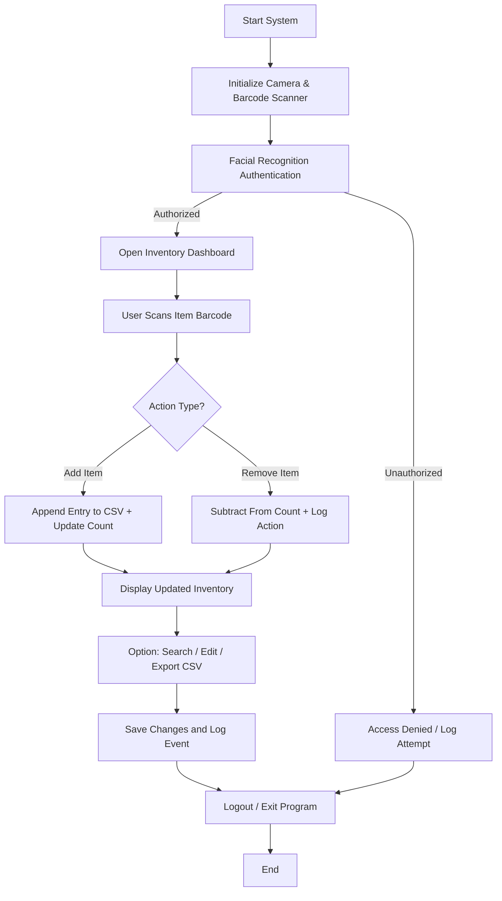

# Medical Inventory System — NASA Hunch 2025-26

> An AI-powered medical inventory system incorporating facial recognition for secure access.  
> Built as part of the NASA Hunch program cycle 2025-26.

---

## Table of Contents
- [About](#about)
- [Features](#features)
- [Architecture & Components](#architecture--components)
- [System Flowchart](#system-flowchart)
- [Prerequisites](#prerequisites)
- [Installation & Setup](#installation--setup)
- [Usage](#usage)
- [Facial Recognition Module](#facial-recognition-module)
- [Project Status](#project-status)
- [Contributing](#contributing)
- [License](#license)
- [Contact](#contact)

---

## About
The **Medical Inventory System** is designed to help medical facilities (or mobile units) track supplies, manage stock levels, and control access securely using facial recognition.  
Developed for the **NASA Hunch 2025-26** program, the system runs efficiently on a **Raspberry Pi** or similar embedded device — suitable for low-power, remote, or space environments.

---

## Features
### ✅ Current
- In-app barcode scanning for adding/removing medical items.
- Facial recognition to authenticate users.
- Automatic CSV logging of all inventory actions.
- Real-time display of current inventory in a GUI.

### 🎯 Planned / Future
- Search and filter inventory records.
- Edit and delete individual entries.
- Alerts for low stock or expired items.
- Cloud dashboard for mission monitoring.
- Role-based access control (Admin / User).

---

## Architecture & Components
| Component | Description |
|-----------|-------------|
| `medical_inventory.py` | Main GUI and logic for barcode + inventory management. |
| `facial_recognition.py` | Handles user authentication via camera and InsightFace. |
| `scans.csv` | Local data file that stores all inventory transactions. |
| `references/` | Directory containing facial reference images for authorized users. |
| Hardware | Raspberry Pi (or PC), USB barcode scanner, and camera module. |

---

## System Flowchart
Below is a visual overview of how the system operates from authentication to inventory management.



> The flow above represents how user authentication, barcode scanning, and logging interact in the overall system workflow.

---

## Prerequisites
- Python 3.10 +  
- Pip package manager  
- Camera (USB or Pi Camera)  
- Barcode scanner  
- `insightface`, `onnxruntime`, `opencv-python`, `numpy`

---

## Installation & Setup
1. Clone the repository:
   ```bash
   git clone https://github.com/ltl902/Medical-Inventory-System-NASA-Hunch-25-26-
   cd Medical-Inventory-System-NASA-Hunch-25-26-
   ```

2. Install dependencies:
   ```bash
   pip install numpy opencv-python insightface onnxruntime
   ```

3. Prepare facial recognition data:
   - Add authorized user photos in a folder named `references/`.
   - Use clear, frontal images with consistent lighting.

4. Connect your camera and barcode scanner before running.

---

## Usage
Run the main system:
```bash
python3 medical_inventory.py
```

- The app will start the camera and prompt for facial authentication.
- Once verified, the dashboard opens for scanning and managing items.
- Each transaction is saved to `scans.csv` automatically.

Test facial recognition independently:
```bash
python3 facial_recognition.py
```

---

## Facial Recognition Module
This module uses **InsightFace** with **ONNX Runtime** for lightweight, on-device face matching.

### Steps
1. Capture live image from camera.  
2. Detect face and compute facial embeddings.  
3. Compare embeddings with saved user database.  
4. Grant or deny access based on match threshold.

### Setup Tips
- Maintain consistent lighting.  
- Use at least one clear reference image per user.  
- Adjust threshold for accuracy (default ≈ 0.6–0.7).

---

## Project Status
🚧 **In Development** — actively improving:
- Bug fixes for barcode UI.
- Add/Delete/Edit features for CSV entries.
- Search and filtering interface.
- Export to Excel or cloud API.

---

## Contributing
Contributions are welcome!  
1. Fork this repo.  
2. Create a new branch (`feature/your-feature`).  
3. Make changes following PEP 8.  
4. Commit with clear messages.  
5. Submit a Pull Request.

---

## License
This project is open source under the **MIT License**.  
See [LICENSE](LICENSE) for details.

---

## Contact
**NASA Hunch 2025-26 Medical Inventory Team**  
- Maintainer: `<Your Name>`  
- Email: `<your.email@domain>`  
- GitHub: [ltl902](https://github.com/ltl902)

---

> “Efficiency and safety through intelligent design — from lab to orbit.”
