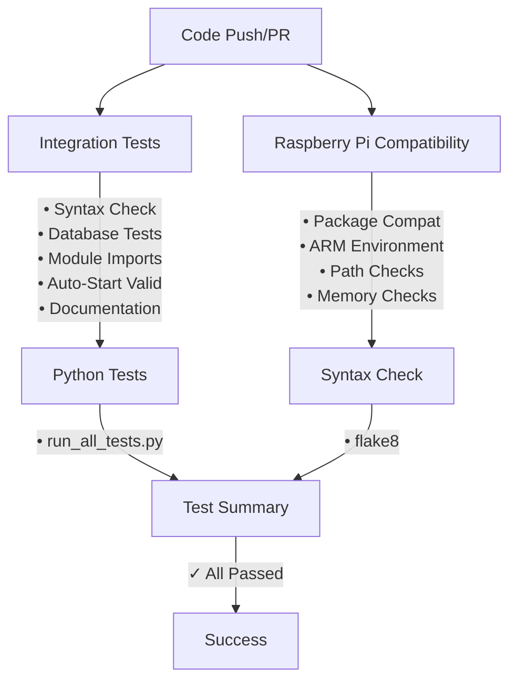

# GitHub Actions Workflow Testing

This document describes the comprehensive test suite for the Medical Inventory System, including integration tests, Raspberry Pi compatibility checks, and continuous integration workflows.

## Workflows Overview

### 1. Integration Test (`integration-test.yml`)

**Purpose**: Comprehensive integration testing across multiple Python versions and platforms.

**Triggers**:
- Push to `main` or `master` branches
- Pull requests to `main` or `master` branches
- Manual workflow dispatch

**Test Matrix**:
- Operating Systems: Ubuntu Latest
- Python Versions: 3.10, 3.11, 3.12

**Test Coverage**:

#### Installation & Dependencies
- ✓ Installs system dependencies (python3-tk, libopencv-dev, etc.)
- ✓ Caches pip packages for faster builds
- ✓ Installs Python dependencies from requirements.txt
- ✓ Verifies all packages are installed correctly

#### Code Quality
- ✓ Python syntax checking with flake8
- ✓ Shell script syntax validation (bash -n)
- ✓ Validates all executable scripts

#### Database Testing
- ✓ Tests DatabaseManager initialization
- ✓ Tests add_scan() functionality
- ✓ Tests get_all_scans() retrieval
- ✓ Tests delete_scan() with reason tracking
- ✓ Tests get_deletion_history()
- ✓ Tests with temporary database files

#### Auto-Start Validation
- ✓ Runs test_autostart_setup.sh
- ✓ Validates all setup files exist
- ✓ Checks script executability
- ✓ Validates systemd service file structure

#### Module Imports
- ✓ Tests db_manager import
- ✓ Tests facial_recognition import
- ✓ Verifies OpenCV, NumPy, Tkinter availability

#### Documentation
- ✓ Checks all documentation files exist
- ✓ Verifies README has required sections
- ✓ Validates auto-start documentation

**Jobs**:
1. `integration-test` - Main integration tests
2. `autostart-validation` - Auto-start configuration validation
3. `documentation-check` - Documentation validation
4. `test-summary` - Aggregates all test results

### 2. Raspberry Pi Compatibility (`raspberry-pi-compat.yml`)

**Purpose**: Validates compatibility with Raspberry Pi 4 environment.

**Triggers**:
- Push to `main` or `master` branches
- Pull requests to `main` or `master` branches
- Manual workflow dispatch

**Tests**:

#### Package Compatibility
- ✓ Uses Python 3.11 (Raspberry Pi OS default)
- ✓ Installs Raspberry Pi OS equivalent packages
- ✓ Tests OpenCV compatibility
- ✓ Tests NumPy compatibility
- ✓ Tests Tkinter compatibility
- ✓ Tests InsightFace compatibility
- ✓ Tests ONNX Runtime compatibility

#### Database Operations
- ✓ Tests database operations in Pi-like environment
- ✓ Validates SQLite functionality

#### Auto-Start Scripts
- ✓ Validates scripts use python3 (Pi compatible)
- ✓ Checks for raspi-config references
- ✓ Verifies Raspberry Pi 4 documentation

#### Systemd Service
- ✓ Validates service file structure
- ✓ Checks graphical.target dependency
- ✓ Verifies DISPLAY variable configuration

#### ARM Compatibility
- ✓ Checks for ARM/Raspberry Pi documentation
- ✓ Verifies memory requirements documented
- ✓ Checks for hardcoded paths
- ✓ Validates dynamic path detection

### 3. Python Tests (`app-tester.yml`)

**Purpose**: Runs existing pytest suite.

**Triggers**:
- Push to `main` or `master` branches
- Pull requests to `main` or `master` branches

**Tests**:
- Runs `run_all_tests.py`
- Executes all pytest test files

### 4. Syntax Check (`syntax-check.yml`)

**Purpose**: Quick Python syntax validation.

**Triggers**:
- Push to `main` branch
- Pull requests to `main` branch

**Tests**:
- flake8 syntax checking
- Checks for Python syntax errors (E9)
- Checks for undefined names (F63, F7, F82)

## Running Tests Locally

### Prerequisites

```bash
# Install dependencies
pip install -r requirements.txt

# Install dev dependencies
pip install pytest flake8
```

### Run Integration Tests Locally

```bash
# Run all pytest tests
pytest -v

# Run specific test file
pytest test_db_manager.py -v
pytest test_medical_inventory.py -v

# Run auto-start validation
./test_autostart_setup.sh

# Check Python syntax
flake8 . --count --select=E9,F63,F7,F82 --show-source --statistics \
  --exclude=venv,env,.git,__pycache__,.pytest_cache

# Validate shell scripts
bash -n install_autostart.sh
bash -n uninstall_autostart.sh
bash -n start_medical_inventory.sh
```

### Run Database Tests

```bash
python -c "
from db_manager import DatabaseManager
import os
import tempfile

with tempfile.NamedTemporaryFile(suffix='.db', delete=False) as f:
    db_path = f.name

try:
    db = DatabaseManager(db_path)
    db.add_scan('TEST123', 'TestUser')
    scans = db.get_all_scans()
    print(f'Database test passed: {len(scans)} scan(s)')
finally:
    os.unlink(db_path)
"
```

### Test Module Imports

```bash
# Test all imports work
python -c "import db_manager; print('✓ db_manager')"
python -c "import facial_recognition; print('✓ facial_recognition')"
python -c "import cv2; print(f'✓ OpenCV {cv2.__version__}')"
python -c "import numpy; print(f'✓ NumPy {numpy.__version__}')"
python -c "import tkinter; print('✓ Tkinter')"
```

## Continuous Integration Workflow



## Test Results & Badges

You can add badges to your README.md to show test status:

```markdown


```

## Troubleshooting CI Failures

### Integration Test Failures

**Dependency Installation Failed**:
```bash
# Check requirements.txt for syntax errors
cat requirements.txt

# Test locally
pip install -r requirements.txt
```

**Database Tests Failed**:
```bash
# Check database tests
pytest test_db_manager.py -v

# Check temporary file permissions
ls -la /tmp/
```

**Module Import Failed**:
```bash
# Verify all dependencies installed
pip list

# Test specific import
python -c "import MODULE_NAME"
```

### Raspberry Pi Compatibility Failures

**Package Not Available**:
- Check if package is available for ARM architecture
- Consider alternative package or version

**Path Issues**:
- Ensure scripts use dynamic path detection
- Avoid hardcoded `/home/pi` or user-specific paths

**Memory Issues**:
- Test with 2GB constraint in mind
- Optimize imports and memory usage

## Manual Testing Checklist

Before deploying to production:

- [ ] All GitHub Actions workflows pass
- [ ] Integration tests pass locally
- [ ] Database operations work correctly
- [ ] Auto-start scripts validated
- [ ] Documentation reviewed
- [ ] Tested on actual Raspberry Pi 4 (if available)
- [ ] Camera and barcode scanner tested
- [ ] Facial recognition tested
- [ ] Service starts on boot
- [ ] Service restarts on failure
- [ ] Logs are accessible

## Adding New Tests

### Add a New Python Test

1. Create `test_feature.py`:
```python
import pytest

def test_new_feature():
    # Your test code
    assert True
```

2. The test will automatically run in CI

### Add a New Workflow Test

Edit `.github/workflows/integration-test.yml`:

```yaml
- name: Test new feature
  run: |
    echo "=== Testing New Feature ==="
    python -c "# your test code"
```

## Performance Benchmarks

The CI tests typically complete in:

- **Integration Tests**: ~5-8 minutes
- **Raspberry Pi Compatibility**: ~3-5 minutes
- **Python Tests**: ~2-3 minutes
- **Syntax Check**: ~1 minute

**Total CI Time**: ~10-15 minutes per commit

## Resources

- [GitHub Actions Documentation](https://docs.github.com/en/actions)
- [pytest Documentation](https://docs.pytest.org/)
- [flake8 Documentation](https://flake8.pycqa.org/)
- [Raspberry Pi Documentation](https://www.raspberrypi.com/documentation/)

## Support

For issues with tests or CI:

1. Check workflow logs in GitHub Actions tab
2. Run tests locally to reproduce
3. Review this documentation
4. Contact development team (see README.md)
